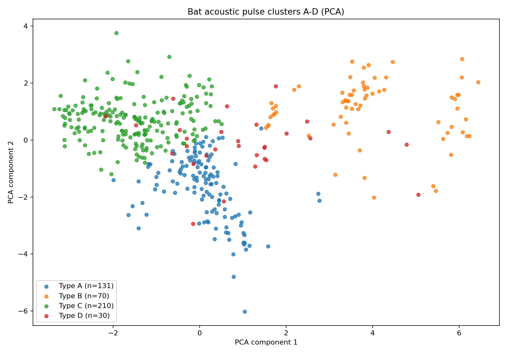
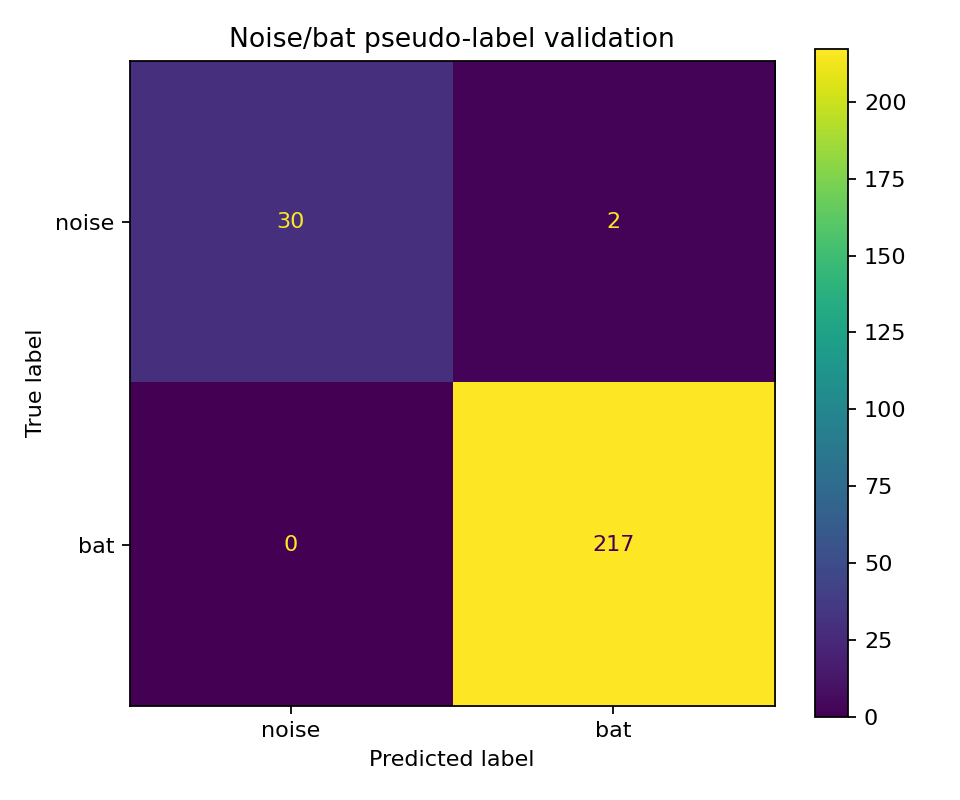

# 蝙蝠超声信号检测与声型聚类原型

这是一个面向生态声学场景的 Python 原型项目：从野外蝙蝠超声录音中自动检测脉冲、提取声学特征、过滤噪声，并将有效脉冲聚类为 A–D 四类临时声型。项目重点是证明“原始录音 → 脉冲检测 → 特征工程 → 聚类/分类 → 新录音预测”的完整流程可以运行。

> **项目定位**：当前版本是声学信号处理与机器学习原型，不是经过专家验证的蝙蝠物种鉴定系统。A–D 代表无监督聚类得到的声型，不能直接写成真实物种。

## 核心功能

- 对 250 kHz WAV 录音进行高通滤波和分块分析。
- 自动检测并精修蝙蝠候选脉冲。
- 实验性分离同一时间段内的近频声波分量。
- 提取持续时间、峰值频率、带宽、频率斜率、SNR 等特征。
- 通过两级流程完成 `noise/bat` 判断与 A–D 声型分类。
- 输出 PCA 图、聚类中心、录音级汇总、模型文件和新录音预测结果。

## 技术栈

Python、NumPy、Pandas、SciPy、Librosa、SoundFile、Matplotlib、scikit-learn、Joblib。

## 项目结构

```text
bat-classifier/
├─ demo.py                        # 无需完整原始数据的快速演示
├─ run.py                         # 完整训练流程入口
├─ requirements.txt
├─ src/bat_classifier/
│  ├─ config.py                   # 参数与路径配置
│  └─ pipeline.py                 # 核心处理流程
├─ data/
│  ├─ README.md
│  ├─ raw/                        # 本地原始 WAV，不提交
│  └─ sample/                     # 内置4秒演示WAV
├─ results/
│  ├─ figures/                    # 关键结果图
│  ├─ tables/                     # CSV 汇总与指标
│  ├─ predictions/                # 新录音预测
│  └─ audio/                      # 切片与分离音频
├─ models/                        # 训练模型，不默认提交
└─ docs/methodology.md            # 方法、边界与后续计划
```

## 可直接运行的 Demo

仓库内置一个 4 秒、约 2 MB 的示例 WAV。它用于展示“候选脉冲检测 → noise/bat 判断 → A-D 临时声型分类 → CSV/JSON 输出”的完整推理流程，不需要下载 167 MB 的原始数据包。

安装依赖后运行：

```powershell
python demo.py --self-test
```

Windows 也可以双击根目录的 `run_demo.bat`。

首次运行会使用仓库已有的两个结果表自动构建演示模型：

- `results/tables/acoustic_pulses.csv`：训练第一层 `noise/bat` 模型；
- `results/tables/acoustic_clusters_ABCD.csv`：训练第二层 A-D 临时声型模型。

默认输入为：

```text
data/sample/demo_xianren_0_4s.wav
```

也可以预测自己的 WAV：

```powershell
python demo.py --input "D:\audio\new_recording.wav"
```

需要强制重新构建演示模型时：

```powershell
python demo.py --rebuild-model --self-test
```

成功后主要输出到：

```text
results/predictions/<文件名>_noise_ABCD.csv
results/predictions/demo_summary.json
results/figures/spectrograms/
results/figures/pulse_zooms/
```

本仓库附带样例在当前测试环境中检测到 61 个有效候选，其中 51 个判为 bat、10 个判为 noise；主要临时声型为 C。该结果只用于验证工程链路可运行，不能解释为真实物种识别结论。测试记录见 [`docs/demo_test.md`](docs/demo_test.md)。

## 快速开始

```powershell
python -m venv .venv
.\.venv\Scripts\Activate.ps1
pip install -r requirements.txt
```

把原始数据按以下任一种方式放置：

- 将 `声波文件.zip` 放到 `data/`；
- 或直接将 WAV 文件放到 `data/raw/`。

然后运行：

```powershell
python run.py
```

训练完成后，可按照终端提示输入一个 WAV 文件或文件夹路径进行预测。


## 当前原型运行结果

本仓库附带一次本地样例运行的汇总结果：

| 指标 | 结果 |
|---|---:|
| 原始录音 | 10 条，共 466.88 秒 |
| 检测到的候选片段 | 578 个 |
| 通过质量筛选的脉冲 | 441 个 |
| 被拒绝的噪声/低质量片段 | 137 个 |
| A/B/C/D 声型数量 | 131 / 70 / 210 / 30 |
| KMeans 轮廓系数 | 0.295 |
| noise/bat 原型伪标签一致率 | 99.20% |
| 临时随机森林复现聚类标签一致率 | 96.40% |

轮廓系数 0.295 表明四类声型存在一定结构，但组间仍有明显重叠。因此，这个结果适合证明流程可行，不足以证明四个自然物种被清晰分开。两个“一致率”衡量的是模型对当前规则标签或聚类标签的复现能力，也不是真实物种识别准确率。

### PCA 声型分布



### noise/bat 原型伪标签验证



详细汇总见 [`results/tables/experiment_summary.csv`](results/tables/experiment_summary.csv)、[`recording_cluster_summary.csv`](results/tables/recording_cluster_summary.csv) 和 [`cluster_centers_ABCD.csv`](results/tables/cluster_centers_ABCD.csv)。

## 当前评估说明

当前第一层 `noise/bat` 标签主要来自自动质量规则，A–D 来自 KMeans 聚类。因此，内部验证分数只能说明模型能否复现这套原型标签，不能当成真实物种识别准确率。正式物种分类需要老师或专家确认的标签，并按“原始录音”分组划分训练集与测试集。

正式版本建议至少报告：
- 录音数量、有效脉冲数量与各类别样本量；
- 宏平均 Precision、Recall、F1；
- 混淆矩阵；
- 按录音分组的交叉验证结果；
- 未见过地点或设备上的外部测试结果。

## 项目亮点
针对野外蝙蝠监测中人工鉴定成本高的问题，设计基于声学信号特征的自动分类方法。
大大减少人工成本。

## 已知限制与下一步

1. 获取可靠物种标签，替换 A–D 临时声型。
2. 增加不同地点、设备、距离和背景噪声条件下的数据。
3. 将 4000 行级核心流程继续拆分为检测、特征、聚类、预测模块，并补充单元测试。
4. 增加命令行参数，取消交互式路径输入。
5. 提供 1–3 个可公开示例 WAV 和可复现的基准结果。

更完整的方法说明见 [`docs/methodology.md`](docs/methodology.md)。
